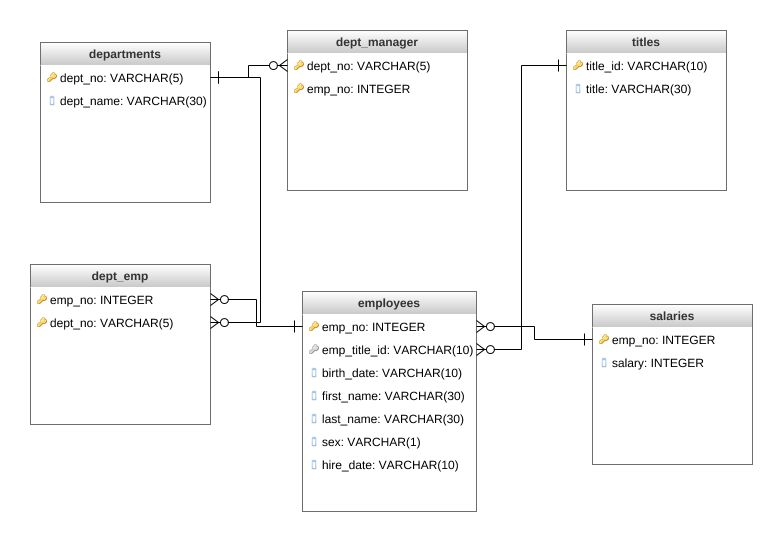

sql-challenge

##Employee Database

###Initial Design - ERD

###Database Creation
1. Run lines 1-49 of schema.sql

2. import all CSV's - departments, dept_employee, dept_manager, employees, salaries, titles from EmployeesSQL file

3. Run lines 53-81 of schema.sql

###Run Queries
1. Run all queries in queries.sql
